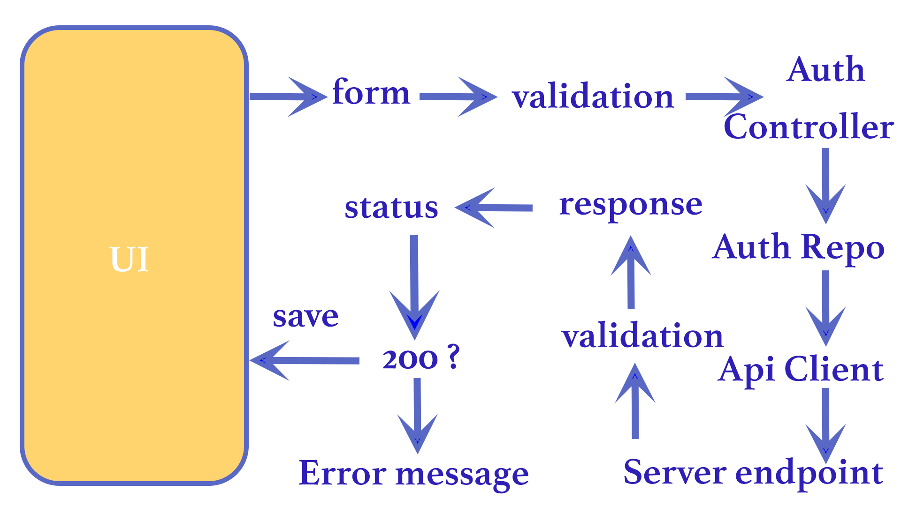
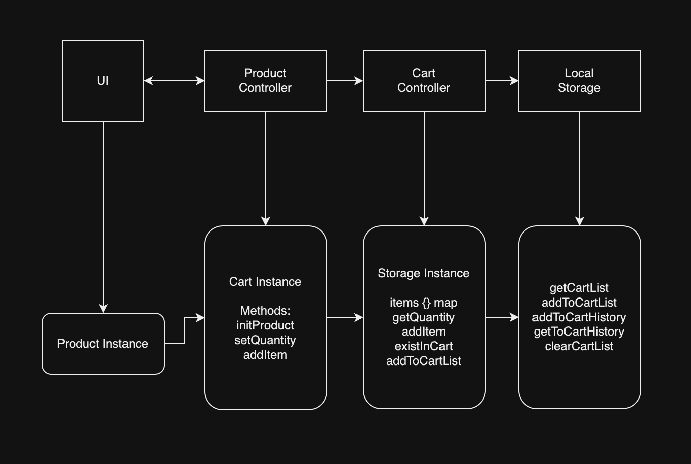

# Food Delivery Flutter App

This Flutter app allows users to: 
- order food, 
- view order history, 
- perform login and logout functions. 

It communicates with the backend food delivery system to fetch food data and manage orders.

## Features

- 食品アイテムを注文する
- 注文履歴を表示する
- ログインおよびログアウト機能
- **食品データを取得するためのバックエンドフードデリバリーシステムとの統合**

## 使用方法

デバイスにFlutterアプリをインストールするだけで、食べ物を注文したり、注文履歴を表示したり、アカウントを簡単に管理したりできます。

## Integration with Backend
The Flutter app communicates with the backend food delivery system through API calls. It fetches food data and manages orders using the provided APIs.

## In the future
## 将来的

**In the future, the app will also integrate with the backend for order processing, order history, and user location tracking.**
将来的には、アプリは注文処理、注文履歴、およびユーザーの位置追跡のためにバックエンドと統合される予定です。

## Contributing

Contributions are welcome! Feel free to submit pull requests or open issues for any improvements or bug fixes.

## Post request flow

## initial architecture 
